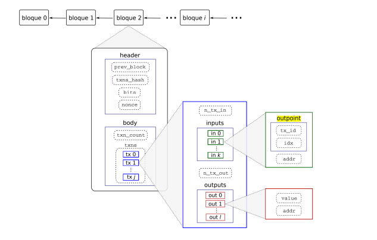

# Algochain
Simplified Merkle trees-based blockchain to make transactions with Satoshis

## Windows
To run it on Windows make sure to install MSYS2 with Mingw32,Mingw64 and Clang, then add the path to the _mingw64/bin_ folder into the user environment variables (system config).

Once here, we'll run make within _build_ folder with 'mingw32-make', and the resulting program _.exe_ will run with the next arguments: 

1) -d, --difficulty,  indicates the expected difficulty of block mining. In other words, the hash h = SHA256(SHA256(header)) must be such that the number of zeros in its most significant bits is equal to or greater than 'd'. This option is mandatory 
2) -i, --input, which controls the input stream of transactions. The program should receive the transactions from the file with the name passed as the argument. If the argument is "-", the program will read them from the standard input
3) -o, --output, allows output to be redirected to the file passed as argument or to the standard output -std::cout- if the argument is "-".